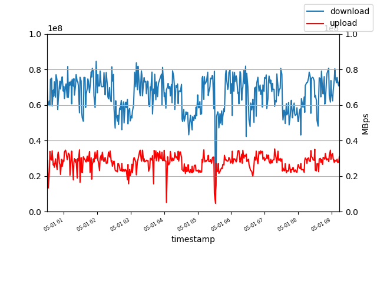

A simple set of python scripts too measure and visualize your internet connection.

[Little background](https://knowledge.rootknecht.net/testing-internet-connection)

## Dependencies

- speedtest (from [speedtest.cli](https://github.com/sivel/speedtest-cli))
- pandas
- matplotlib

## Collect Data

Run 'log_netspeed.py'. This will test every 60 seconds your bandwidth and log the result to `speedtest.log`

For a realistic result do not run any other apps/devices utilizing your internet connection during the tests.

## Visual Data

Run `read_logdata.py`. This will read `speedtest.log` and calculate some statistics and generate a graph `bandwidth.log`

## Example

## Todo

- docstrings
- advanced plotting!
- containerization
- formated output of calculated values
- external configuration
- Graph for Ping
