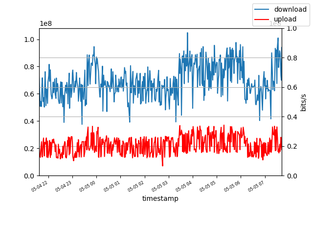

A simple set of python scripts too measure and visualize your internet connection.

[Little background](https://knowledge.rootknecht.net/testing-internet-connection)

## Dependencies

- Docker :)

## Build

docker build . -t vis

## Collect Data

Run `docker run ${PWD}/results:/results vis test`

## Visual Data

Run `docker run ${PWD}/results:/results vis plot`

## Examples

## Todo

- advanced plotting!
- non docker doc
- formated output of calculated values
- external configuration
- Graph for Ping
